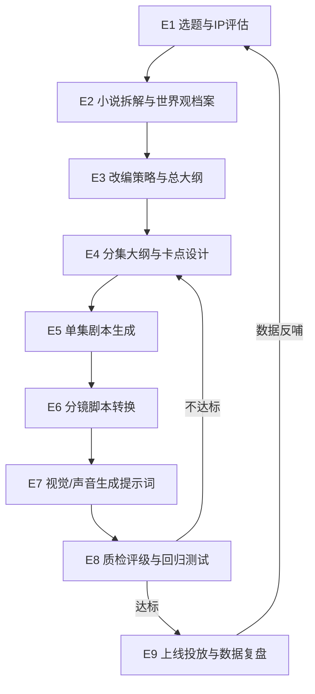

# Codex 制作 S 级红果漫剧「小说 → 剧本」提示词全链路资产框架

> 版本:v1.0 · 定位:总纲/框架文档
> 适用对象:漫剧制片人、编剧、AI 工程师(Codex 操作者)、后期与投放同学
> 一句话说明:本框架把「拿到一部小说 → 产出可上线的 S 级红果漫剧」拆成 **9 个流水线环节**,为每个环节定义标准化的**提示词资产、输入输出契约、质检清单**,并规定如何用 Codex 把整条链路工程化、可版本管理、可批量复制。

---

## 目录

1. [目标与术语](#1-目标与术语)
2. [S 级对标:评级要素与内容标准](#2-s-级对标评级要素与内容标准)
3. [全链路总览](#3-全链路总览)
4. [资产分层架构(L0–L3)](#4-资产分层架构l0l3)
5. [九大环节资产明细](#5-九大环节资产明细)
6. [仓库目录结构与命名规范](#6-仓库目录结构与命名规范)
7. [Codex 工作流:如何驱动整条链路](#7-codex-工作流如何驱动整条链路)
8. [核心数据 Schema](#8-核心数据-schema)
9. [质量评估与迭代闭环](#9-质量评估与迭代闭环)
10. [合规红线清单](#10-合规红线清单)
11. [落地路线图](#11-落地路线图)

---

## 1. 目标与术语

### 1.1 本框架要解决的问题

- **不可复制**:爆款漫剧靠个别编剧的手感,提示词散落在聊天记录里,换人即失传。
- **不可迭代**:改一版剧本要从头重跑对话,无法定位是哪个环节的提示词导致质量下滑。
- **不可批量**:一个团队想同时推进 5 部剧,人工流程立刻崩溃。

**解法**:把提示词当作代码资产管理——模板化、参数化、版本化、可测试;用 Codex 作为流水线执行器,人只在关键决策点介入。

### 1.2 术语表

| 术语 | 含义 |
|---|---|
| 红果漫剧 | 红果短剧平台上的动态漫画/AI 动画竖屏短剧,单集约 1–2 分钟,总集数常见 60–100 集 |
| S 级 | 平台内容评级最高档,直接决定分账系数与流量扶持;核心看题材稀缺度、前 3 集卡点、完播率预估、画面完成度 |
| 全链路资产 | 从选题到上线复盘,每个环节沉淀的提示词模板、Schema、检查清单、范例库的总和 |
| 提示词资产 | 系统提示词(System Prompt)+ 任务模板(Task Template)+ 少样本范例(Few-shot)+ 质检提示词(Critic Prompt)四件套 |
| 卡点 | 每集结尾的强钩子(反转/危机/悬念),决定「下一集点击率」 |
| 黄金三集 | 前 3 集,决定用户留存与平台评级的最重要样本 |
| Codex | 作为流水线执行器的 AI 编码代理:读取资产库、按 DAG 执行各环节、产出结构化文件、跑质检脚本 |

### 1.3 设计原则

1. **契约先行**:环节之间只通过结构化文件(JSON/Markdown 表格)交接,不通过自然语言口头传递。
2. **人管决策,Codex 管执行**:选题、卡点方向、终审由人拍板;拆解、改写、格式化、质检由 Codex 批量完成。
3. **每个提示词都可回归测试**:模板改版后,用固定的「基准小说样本」重跑,对比产出打分。
4. **一切产出可溯源**:每个剧本文件头部记录所用模板版本、模型、参数、上游文件哈希。

---

## 2. S 级对标:评级要素与内容标准

> 提示词写得再好,不知道平台怎么打分就是盲人骑马。本节是所有 Critic(质检)提示词的评分依据来源。

### 2.1 评级要素拆解

| 维度 | 权重定性 | S 级要求 | 对应链路环节 |
|---|---|---|---|
| 题材与设定稀缺度 | 高 | 热门赛道 + 差异化设定(如"战神+奶爸"复合型),避开近 90 天饱和题材 | E1 选题 |
| 黄金三集钩子密度 | 极高 | 第 1 集 30 秒内建立核心冲突;每集 ≥2 个情绪点;每集结尾强卡点 | E3/E4/E5 |
| 节奏与信息密度 | 高 | 单集 1–2 分钟内完成「危机→对抗→小反转→新钩子」;无注水对白 | E5 剧本 |
| 人设记忆点 | 高 | 主角有一句口头禅/一个标志动作/一个反差萌点;反派动机成立 | E2/E4 |
| 画面完成度 | 中高 | 角色一致性(跨集不崩脸)、分镜运镜有设计感、关键帧情绪到位 | E6/E7 |
| 完播与追更预估 | 极高 | 平台以试映数据回测;链路上用 Critic 提示词做事前模拟评分 | E8 质检 |
| 合规安全 | 一票否决 | 无违规元素(见第 10 节红线清单) | 全环节 |

### 2.2 S 级内容的写作铁律(注入所有剧本类提示词的 System 层)

- **10 秒定生死**:每集前 10 秒必须出现冲突或悬念画面,禁止铺垫式开场。
- **对白即冲突**:每句对白要么推进冲突、要么塑造人设、要么埋钩子,三者皆无则删。
- **反转要有伏笔**:反转前至少埋 1 处可回溯的伏笔,禁止「天降反转」。
- **情绪曲线量化**:每集标注情绪值曲线(1–10),结尾必须高于开头且留缺口。
- **竖屏思维**:单画面聚焦 1–2 个角色,表情特写优先于大场面;文字信息用画内字卡强化。

---

## 3. 全链路总览



**交接契约一览**:

| 环节 | 输入 | 输出(结构化文件) |
|---|---|---|
| E1 选题与 IP 评估 | 小说文本/榜单数据 | `01_topic/ip-scorecard.json` |
| E2 小说拆解 | 小说全文 | `02_bible/story-bible.md` + `characters.json` |
| E3 改编策略与总大纲 | Story Bible | `03_outline/adaptation-strategy.md` + `master-outline.md` |
| E4 分集大纲 | 总大纲 | `04_episodes/ep-outline-{001..N}.json` |
| E5 单集剧本 | 分集大纲 | `05_scripts/ep-{001..N}.script.md` |
| E6 分镜脚本 | 单集剧本 | `06_storyboard/ep-{001..N}.board.json` |
| E7 生成提示词 | 分镜脚本 + 角色设定 | `07_genprompts/ep-{001..N}/{shot-xxx}.prompt.yaml` |
| E8 质检评级 | 全部上游产出 | `08_qa/qa-report-{date}.md` + 评分 JSON |
| E9 投放复盘 | 上线数据 | `09_ops/retro-{date}.md` → 反哺资产库 |

---

## 4. 资产分层架构(L0–L3)

```text
L0 规范层(变化最慢)
├── S级标准手册(第2节的细化版)
├── 合规红线清单
├── 术语与命名规范
└── 全链路 Schema 定义(第8节)

L1 提示词模板层(核心资产,版本化管理)
├── 每环节四件套:System / Task / Few-shot / Critic
├── 题材包(Genre Pack):战神、赘婿、萌宝、逆袭、玄幻、甜宠…
│   └── 每包含:题材专属人设库、桥段库、卡点句式库、禁忌清单
└── 风格包(Style Pack):国漫厚涂、2.5D、韩漫、水墨…(供 E7 用)

L2 项目实例层(每部剧一个目录)
├── 项目配置 project.yaml(选用哪个题材包/风格包/模板版本)
└── 01_topic ~ 09_ops 九环节产出物

L3 产出物沉淀层(跨项目复用)
├── 爆款卡点案例库(从 E9 复盘回流)
├── 高分剧本片段库(Few-shot 素材来源)
└── 失败案例库(反例,喂给 Critic 提示词)
```

**关键点**:L1 是团队真正的护城河。每次 E9 复盘发现的规律(如某类卡点完播率高 15%),都要落回 L1 的题材包与 Few-shot 库,形成复利。

---

## 5. 九大环节资产明细

> 每个环节按统一结构描述:**目标 → 提示词四件套骨架 → 质检清单**。骨架给出可直接扩写的模板框架,`{{变量}}` 为参数位。

### E1 选题与 IP 评估

**目标**:判断一部小说是否值得改编为漫剧,并给出 S 级潜力评分。

**提示词四件套**:

- **System**:`你是红果漫剧的资深内容评估官,熟悉近90天各题材饱和度与评级偏好……评分必须给出依据,禁止空泛套话。`
- **Task 模板**:

```text
基于以下小说信息完成 IP 评估:
【小说标题】{{title}}
【题材标签】{{genre_tags}}
【前三章全文】{{first_3_chapters}}
【全文梗概】{{synopsis}}

输出 ip-scorecard.json,包含:
1. 题材赛道判定 + 近90天饱和度定性(需说明判断依据)
2. 核心爽点提取(≤5条,每条标注出现章节)
3. 主角人设记忆点评估(有/无/可改造)
4. 漫剧适配度:视觉呈现难度、集数容量预估(60/80/100集)
5. S级潜力分(1-100)+ 三条最关键的改编建议
6. 合规风险初筛(对照红线清单逐条过)
```

- **Few-shot**:2 个正例(评过且实际拿到 S 的剧)+ 1 个反例(评分虚高最终 B 级)。
- **Critic**:检查评分依据是否可追溯到原文章节、饱和度判断是否引用了数据源。

**质检清单**:☐ 每条爽点有章节出处 ☐ 集数预估有推算过程 ☐ 红线逐条核对 ☐ 结论可被第二人复核。

---

### E2 小说拆解与世界观档案(Story Bible)

**目标**:把几十万字小说压缩为后续所有环节唯一信源的「圣经文档」,杜绝下游环节各自读原文导致设定漂移。

**提示词四件套**:

- **System**:`你是文学拆解专家,任务是无损提取而非创作。禁止添加原文没有的设定;每条信息标注章节出处。`
- **Task 模板**(分章批处理,Codex 循环调用):

```text
对第 {{chapter_range}} 章执行拆解,增量更新以下档案:
1. characters.json:人物新增/变化(外貌、口癖、关系、动机转折点)
2. worldbuilding.md:世界观规则新增(力量体系、组织、地点)
3. plot-beats.md:本段情节节拍(每拍一句话 + 冲突类型标签)
4. golden-scenes.md:高光名场面(原文摘录 + 为什么爽)
5. foreshadowing.md:伏笔登记表(埋设点/回收点/状态)
```

- **Few-shot**:1 个「拆解粒度标准」范例章节。
- **Critic**:抽查 3 条设定回原文核对;检查人物关系图无孤儿节点;伏笔表无「已埋未回收且后文不再出现」的悬空项。

**质检清单**:☐ 全部信息有章节出处 ☐ 人物档案含视觉描述字段(供 E7 用)☐ 名场面按爽感排序 ☐ 增量更新无覆盖丢失。

---

### E3 改编策略与总大纲

**目标**:决定「保留什么、砍掉什么、重排什么」,并产出全剧总大纲(幕结构 + 集数分配)。**这是人介入最深的环节**。

**提示词四件套**:

- **System**:`你是漫剧改编总编剧。小说逻辑是"沉浸铺垫",漫剧逻辑是"即时爽感",你的职责是暴力重构而非忠实还原……`
- **Task 模板**:

```text
基于 story-bible 与 ip-scorecard,产出改编策略:
1. 开场重构:从原文第 {{n}} 章的 {{scene}} 切入(要求:30秒内建立核心冲突),
   给出 3 个候选开场方案,各附情绪值曲线预估
2. 主线取舍表:保留线 / 合并线 / 删除线,各附理由
3. 集数分配:{{total_episodes}} 集,按「三幕 + 若干爽点波峰」分配,
   标注每 10 集一个大高潮的位置
4. 付费卡点位(如有):标注哪几集是强付费钩子
5. 与原著粉的兼容策略:哪些名场面必须保留
```

- **Few-shot**:1 个「原文开场 vs 改编开场」对照范例,展示重构幅度。
- **Critic**:验证开场方案是否满足 10 秒定生死;删除线是否影响伏笔回收(交叉核对 foreshadowing.md)。

**质检清单**:☐ 人工确认开场方案 ☐ 每 10 集有大高潮 ☐ 删线不断伏笔 ☐ 总大纲每集一句话可讲清。

---

### E4 分集大纲与卡点设计

**目标**:把总大纲展开为逐集大纲,**卡点是本环节的生命线**。

**提示词四件套**:

- **System**:`你是卡点设计师。每集结尾卡点从卡点句式库({{genre_pack}}/hooks.md)中选型并变体,禁止连续3集使用同类型卡点……`
- **Task 模板**(每批 10 集,滚动上下文):

```text
展开第 {{ep_start}}–{{ep_end}} 集大纲,每集输出 JSON:
- 本集目标(一句话)
- 节拍表(3-5拍,每拍标注冲突类型与情绪值1-10)
- 结尾卡点:类型标签(反转/危机/身份揭露/误会/悬念)+ 具体内容
- 与下集的承接句
- 需要的名场面引用(链接 golden-scenes.md 条目)
约束:情绪值曲线结尾>开头;卡点类型与前2集不重复
```

- **Few-shot**:3 组「平庸卡点 → S 级卡点」改写对照。
- **Critic**:统计全剧卡点类型分布(单一类型 ≤35%);检查情绪值曲线无连续 3 集下行;黄金三集单独用加严标准复评。

**质检清单**:☐ 黄金三集人工终审 ☐ 卡点类型分布达标 ☐ 每集节拍 ≤5 个(防超时长)☐ 伏笔埋设/回收登记同步更新。

---

### E5 单集剧本生成

**目标**:分集大纲 → 可直接进分镜的完整剧本(对白 + 动作 + 画内字卡 + 旁白)。

**提示词四件套**:

- **System**:注入第 2.2 节写作铁律全文 + `单集台词总量控制在 {{word_budget}} 字内(对应1-2分钟);对白口语化,单句≤20字;禁止文学腔`。
- **Task 模板**:

```text
基于 ep-outline-{{ep_id}}.json 写第 {{ep_id}} 集剧本,格式遵循 script-schema:
- 场景标题行(场号/内外/日夜/地点)
- 角色对白(称谓必须与 characters.json 一致)
- 动作指示(可视觉化动词,禁止心理描写式指示)
- 画内字卡(关键信息强化,每集≤3处)
- 结尾卡点画面的单独强调标注
写完后自查:逐句对白过"冲突/人设/钩子"三选一测试,不通过的句子删除或重写。
```

- **Few-shot**:2 个满分单集剧本(来自 L3 高分片段库)。
- **Critic**:字数预算核查;称谓一致性(与 characters.json 比对);「三选一测试」抽检;卡点画面是否可视觉化。

**质检清单**:☐ 时长换算达标 ☐ 无心理描写式动作指示 ☐ 前 10 秒有冲突画面 ☐ 与大纲节拍逐拍对应。

---

### E6 分镜脚本转换

**目标**:剧本 → 逐镜头分镜表(镜号、景别、运镜、时长、画面描述、台词/音效挂载)。

**提示词四件套**:

- **System**:`你是竖屏漫剧分镜师。竖屏构图原则:单镜1-2角色、表情特写优先、上下构图利用……每集镜头数控制在 {{shot_budget}} 个以内。`
- **Task 模板**:

```text
将 ep-{{ep_id}}.script.md 转换为分镜 JSON(board-schema):
每镜头包含:shot_id / 景别(远全中近特)/ 运镜(推拉摇移固定)/
预估秒数 / 画面描述(纯视觉语言)/ 出场角色ID / 台词行引用 /
音效与BGM情绪标签 / 是否关键帧(卡点、高光必须标记)
约束:总秒数 = {{target_duration}}±10%;特写占比≥40%;卡点镜头必须是本集最后一镜
```

- **Few-shot**:1 集完整分镜范例(含好/坏镜头对照注释)。
- **Critic**:秒数加总校验;台词行引用无遗漏(每句对白都挂到镜头);关键帧标记数量合理(每集 2–4 个)。

**质检清单**:☐ 秒数误差 ≤10% ☐ 台词全覆盖 ☐ 特写占比达标 ☐ 卡点镜头有独立画面设计。

---

### E7 视觉/声音生成提示词

**目标**:为每个镜头产出下游生成工具(文生图/图生视频/TTS)可直接消费的提示词包,**核心难题是角色一致性**。

**资产构成**:

1. **角色一致性资产**:每角色一份 `character-sheet.yaml`(标准三视图提示词 + 固定特征锚词 + LoRA/参考图引用),全剧锁定。
2. **风格包**:全局风格前缀(画风、色调、线条)+ 负向提示词基线,写入 `project.yaml` 后所有镜头统一注入。
3. **镜头提示词模板**:

```text
为 shot {{shot_id}} 生成提示词包(prompt-schema):
- image_prompt: [全局风格前缀] + [角色锚词组] + [画面描述转译] + [景别/构图词] + [情绪光效词]
- negative_prompt: [基线] + [本镜特定排除项]
- motion_prompt(图生视频): 主体动作 / 镜头运动 / 时长
- tts: 角色音色ID / 情绪标签 / 语速 / 重音词
- sfx_bgm: 音效清单 + BGM情绪段落标记
约束:画面描述只用视觉词汇;角色锚词组必须从 character-sheet 原样复制,禁止改写
```

- **Critic**:锚词完整性校验(脚本可自动 diff);同一场景相邻镜头的环境描述一致性;负向提示词含合规排除项。

**质检清单**:☐ 角色锚词零改写 ☐ 场景连续镜头环境词一致 ☐ 关键帧镜头有加强版提示词 ☐ TTS 情绪标签与情绪值曲线吻合。

---

### E8 质检评级与回归测试

**目标**:上线前用 Critic 提示词群 + 脚本化检查,模拟平台评级,产出整改清单。

**资产构成**:

1. **模拟评级提示词**(对标第 2.1 节七维度,输出与 ip-scorecard 同构的评分):黄金三集加严双评(两个不同 Critic 提示词独立打分,分差 >15 触发人工仲裁)。
2. **机械检查脚本**(Codex 编写并维护,不耗模型调用):
   - Schema 校验(所有 JSON 产出)
   - 称谓/角色 ID 全链一致性
   - 时长/字数预算核查
   - 卡点类型分布统计
   - 伏笔登记表闭环检查
3. **回归测试集**:固定 3 部「基准小说」样本,L1 模板每次改版后重跑 E2–E5,对比历史评分,防止模板劣化。

**质检清单**:☐ 七维度全过 ☐ 机械检查零报错 ☐ 黄金三集双评通过 ☐ 整改项闭环后才可出厂。

---

### E9 上线投放与数据复盘

**目标**:用真实数据反哺资产库,形成复利闭环。

**资产构成**:

1. **投放物料提示词**:剧名候选(A/B 用)、单集标题钩子句、封面图提示词、简介文案模板。
2. **复盘模板** `retro-template.md`:
   - 逐集完播率/流失点 vs 当集卡点类型 → 更新题材包卡点库的效果权重
   - 高流失集的剧本回溯 → 存入 L3 失败案例库
   - 爆量集片段 → 存入 L3 高分片段库,成为新 Few-shot
3. **资产回流 SOP**:每次复盘必须产出 ≥1 条 L1 层资产变更(哪怕只是给某个卡点句式加一条效果注记),由 Codex 提 PR、人审合并。

---

## 6. 仓库目录结构与命名规范

```text
manju-pipeline/
├── AGENTS.md                    # Codex 的总操作手册(见第7节)
├── L0-standards/
│   ├── s-grade-manual.md
│   ├── compliance-redlines.md
│   └── schemas/                 # 第8节全部 JSON Schema
├── L1-prompts/
│   ├── e1-topic/    ├── e2-bible/   ├── e3-outline/
│   ├── e4-episodes/ ├── e5-script/  ├── e6-board/
│   ├── e7-genprompt/├── e8-qa/      └── e9-ops/
│   │   └── (每目录下:system.md / task.md / fewshot/ / critic.md)
│   ├── genre-packs/
│   │   └── zhanshen/  (persona.md / tropes.md / hooks.md / taboos.md)
│   └── style-packs/
│       └── guoman-houtu/ (style-prefix.txt / negative-base.txt)
├── L2-projects/
│   └── {project-slug}/
│       ├── project.yaml         # 锁定模板版本、题材包、风格包、参数
│       ├── source/novel.txt
│       └── 01_topic/ … 09_ops/
├── L3-library/
│   ├── hook-cases/  ├── golden-snippets/  └── failure-cases/
└── tools/                       # 机械检查脚本(Codex 编写维护)
```

**命名规范**:

- 模板版本:`e5-script/task.md` 头部 YAML frontmatter 标注 `version: 2.3.0`,语义化版本(改约束=minor,改评分标准=major)。
- 产出物溯源头:每个产出文件顶部注入 `generated_by: e5-task@2.3.0 | model: {{model}} | upstream_hash: {{sha}}`。
- 项目 slug:`{题材缩写}-{剧名拼音}-{yymm}`,如 `zs-zhanshenguilai-2608`。

---

## 7. Codex 工作流:如何驱动整条链路

### 7.1 AGENTS.md 核心内容(Codex 的常驻指令)

```markdown
# AGENTS.md(要点)
1. 任何环节执行前,先读 project.yaml 确认模板版本与参数,再读上游产出文件。
2. 严格按 L0-standards/schemas 输出;产出后立即跑 tools/ 下对应校验脚本。
3. 每个环节产出 = 一次 git commit,commit message 格式:`[E5][ep-012] 生成单集剧本 (task@2.3.0)`。
4. 遇到以下情况停止并请求人工决策:合规红线命中、Critic 双评分差>15、
   上游文件哈希与溯源头不一致(说明上游被改过但下游未重跑)。
5. 禁止跨环节抄近路(如跳过 E4 直接从总大纲写剧本)。
```

### 7.2 典型执行会话(人机分工)

| 步骤 | 执行者 | 动作 |
|---|---|---|
| 1 | 人 | 放入小说,填 `project.yaml`(选题材包/风格包),发指令「跑 E1」 |
| 2 | Codex | E1 评估 → 产出 scorecard → 提交 |
| 3 | 人 | 审 scorecard,拍板立项;确认 E3 开场方案(三选一) |
| 4 | Codex | 流水线跑 E2→E3→E4(黄金三集先行:只展开前 3 集全链到 E7) |
| 5 | 人 | **黄金三集终审**(本框架最重要的人工节点) |
| 6 | Codex | 终审通过后批量展开剩余集数,分批跑 E4→E7,每批自动过 E8 |
| 7 | Codex | 全剧 E8 总评 → 整改循环直至达标 |
| 8 | 人 | 出厂终审 → 交付制作/上线 |
| 9 | Codex | E9 复盘 → 对 L1/L3 提资产回流 PR → 人审合并 |

### 7.3 并行与增量

- **批处理**:E4/E5/E6/E7 均以 10 集为批,批内并行、批间串行(保证卡点不重复约束的滚动上下文)。
- **增量重跑**:上游文件变更时,Codex 依据溯源头哈希自动定位需要重跑的下游最小集合。
- **多项目并行**:L2 下每项目独立目录,互不干扰;L1 模板改版走分支 + 回归测试后合并。

---

## 8. 核心数据 Schema

> 完整 JSON Schema 存于 `L0-standards/schemas/`,此处给出两个最核心结构的示意。

### 8.1 分集大纲 `ep-outline.schema`

```json
{
  "ep_id": "012",
  "goal": "主角身份第一次暴露给反派",
  "beats": [
    {"beat": 1, "summary": "…", "conflict_type": "身份危机", "emotion_value": 4},
    {"beat": 2, "summary": "…", "conflict_type": "正面对抗", "emotion_value": 7}
  ],
  "ending_hook": {
    "type": "身份揭露",
    "content": "反派捡起地上的徽章,瞳孔骤缩",
    "forbidden_repeat_window_ok": true
  },
  "bridge_to_next": "徽章的真正主人此刻正在赶来的路上",
  "golden_scene_refs": ["gs-023"],
  "foreshadow_ops": [{"id": "fs-07", "op": "payoff"}]
}
```

### 8.2 镜头提示词包 `shot-prompt.schema`

```json
{
  "shot_id": "ep012-s018",
  "is_keyframe": true,
  "image_prompt": "<style-prefix> <char-anchor:fanpai-A> close-up, 捡起徽章的手部特写切换瞳孔特写, 冷色调顶光, 竖屏构图",
  "negative_prompt": "<negative-base> 多余人物, 现代物品穿帮",
  "motion_prompt": {"subject": "瞳孔骤缩", "camera": "急推", "duration_s": 2.5},
  "tts": [{"char_id": "fanpai-A", "voice": "v-male-03", "emotion": "震惊压抑", "line_ref": "ep012-L44"}],
  "sfx_bgm": {"sfx": ["金属落地声"], "bgm_mark": "悬疑骤停"}
}
```

---

## 9. 质量评估与迭代闭环

### 9.1 三层评估体系

| 层 | 时机 | 手段 | 成本 |
|---|---|---|---|
| 机械层 | 每次产出后即时 | Schema/预算/一致性脚本 | 零模型成本 |
| 模拟层 | 每批次完成后 | Critic 提示词模拟评级 | 低 |
| 真实层 | 上线后 | 完播率/流失点/追更率 | 数据回收周期 |

### 9.2 核心过程指标(用于判断链路健康度)

- **一次通过率**:各环节产出未触发整改直接过 E8 的比例(目标 ≥70%)。
- **模拟分与真实评级偏差**:E8 模拟 S 但实际 A 的项目要做归因,修 Critic。
- **卡点效果权重表**:各卡点类型的真实「下一集点击率」均值,季度更新进题材包。
- **模板回归分**:L1 每次改版,基准小说重跑评分不得低于上一版(允许 -2 分容差)。

### 9.3 资产复利飞轮

```text
真实数据(E9)→ 更新卡点权重/案例库(L3)→ 更新 Few-shot 与题材包(L1)
→ 下一部剧起点更高 → 更好的数据 → 循环
```

---

## 10. 合规红线清单

> 一票否决项,注入所有生成类提示词的 System 层,并在 E1 初筛、E8 终检双卡。

- 血腥暴力具象化描写/画面(打斗可以,虐杀细节不可以)
- 色情低俗、软色情擦边(镜头语言与台词双查)
- 未成年人不当情节;校园霸凌美化
- 赌博、毒品、封建迷信的正面呈现
- 侮辱性地域/职业/性别刻板设定
- 现实政治、宗教敏感元素
- 抄袭:名场面改写需过原创性检查,禁止逐句搬运他剧台词
- 原著授权范围外的衍生改编(立项时法务确认)

---

## 11. 落地路线图

| 阶段 | 交付物 | 验收标准 |
|---|---|---|
| 一、骨架搭建 | 仓库结构 + L0 全部 Schema + AGENTS.md | Codex 能按契约空跑通九环节(用占位内容) |
| 二、首个题材包 | 选 1 个主力题材,写全 E1–E5 四件套 + 题材包 | 用 1 部真实小说产出黄金三集,人工评审达 A 以上 |
| 三、视觉链路 | E6/E7 模板 + 1 个风格包 + 角色一致性资产流程 | 黄金三集出片,角色跨集一致性通过 |
| 四、质检闭环 | E8 Critic 群 + 机械脚本 + 回归测试集 | 一次通过率 ≥50% 起步 |
| 五、规模化 | 第 2、3 个题材包;多项目并行;E9 回流 SOP | 同时推进 ≥3 部剧,资产回流 PR 每周 ≥1 条 |

---

## 附:快速自检(拿到本框架后先回答)

1. 我们的第一个主力题材是什么?(决定首个 Genre Pack)
2. 下游制作用什么生成工具栈?(决定 E7 prompt-schema 的字段)
3. 谁是黄金三集终审人?(第 7.2 节步骤 5 的责任人)
4. 基准小说选哪 3 部?(决定回归测试集)
5. 现有爆款剧的剧本能否拿到 2–3 部?(冷启动 Few-shot 库)
